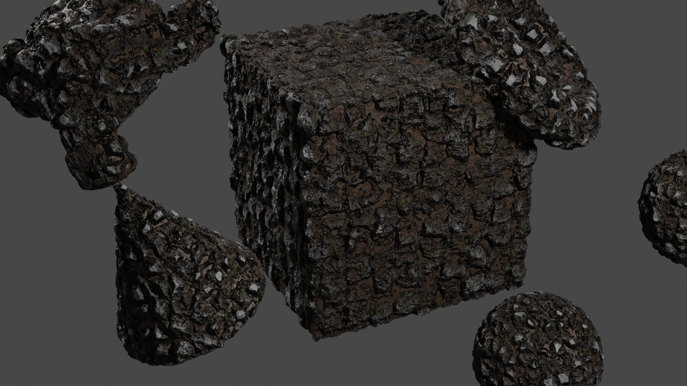
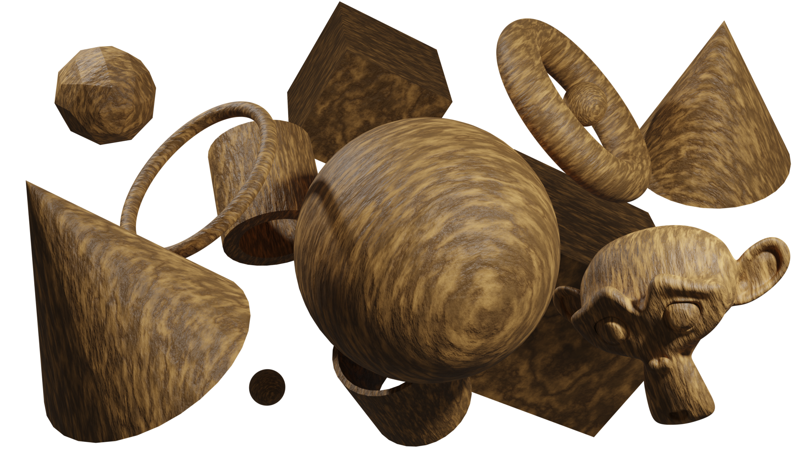
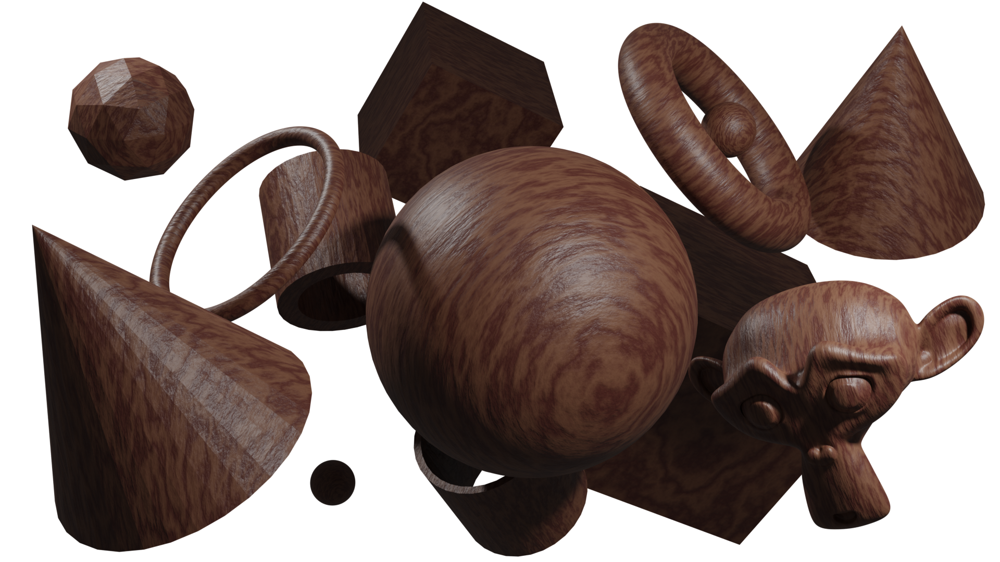
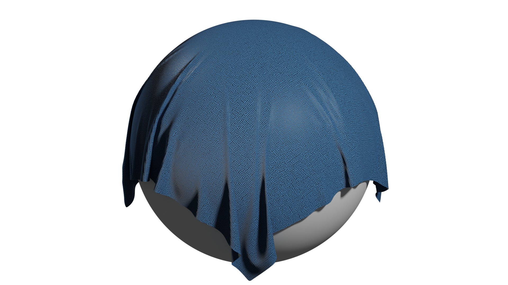

# Library of 3D

A collection of Materials, Textures, Shaders, Models and more.

# Collection

## Materials

### Metal

- [ ] [Iron]()
- [ ] [Gold]()
- [ ] [Copper]()

### Wood

- [ ] [Oak Log]()
- [ ] [Birch Log]()
- [ ] [Walnut Log]()

- [x] [Oak Wood](materials/oak.blend)
- [ ] [Birch Wood]()
- [x] [Walnut Wood](materials/walnut.blend)

- [ ] [Particle Board / Chipboard]()
- [ ] [Planks]()

### Stone

- [x] [Cobblestone](materials/cobblestone.blend)
- [ ] [Stone Wall]()
- [ ] [Rock Surface]()

### Natural

- [ ] [Mud]()
- [ ] [Dirt]()
- [ ] [Gravel]()
- [ ] [Sand]()
- [ ] [Snow]()

### Walls

- [ ] [Concrete]()
- [ ] [Brick Wall]()
- [ ] [Stone Wall]()

### Fabric

- [ ] [Red]()
- [x] [Blue](materials/fabric_blue.blend)
- [ ] [Green]()
- [ ] [Purple]()
- [ ] [Yellow]()

- [ ] [Red (Pattern)]()
- [ ] [Blue (Pattern)]()
- [ ] [Green (Pattern)]()
- [ ] [Purple (Pattern)]()
- [ ] [Yellow (Pattern)]()

- [ ] [Leather]()

## Models

### Walls

- [ ] [Fence]()
- [ ] [Building Wall]()

### Chess

- [ ] [Chessboard]()
- [ ] [Piece (Queen)]()
- [ ] [Piece (King)]()
- [ ] [Piece (Pawn)]()
- [ ] [Piece (Bishop)]()
- [ ] [Piece (Knight)]()
- [ ] [Piece (Rook)]()

### Buildings

- [ ] [Hospital]()
- [ ] [Small House]()
- [ ] [Big House]()
- [ ] [Skyscraper]()

### Other

- [x] [Material Preview](models/material_preview.blend)

# Screenshots

|                                                                                           |                                                                                             |
| ----------------------------------------------------------------------------------------- | ------------------------------------------------------------------------------------------- |
| [Cobblestone](materials/cobblestone.blend)  | [Oak](materials/oak.blend)                                    |
| [Walnut](materials/walnut.blend)                      | [Fabric (Blue)](materials/fabric_blue.blend)  |

# How to use

You need to have `Node Wrangler` and `Node Presets` installed and activated in your blender installation.

You can use ANY materials you find here, but be warned: some materials, textures, models come from youtube tutorials, etc.
