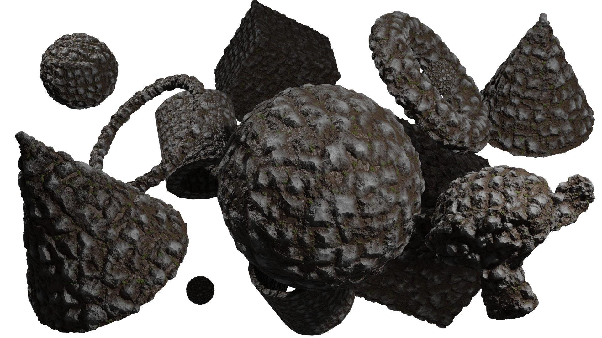
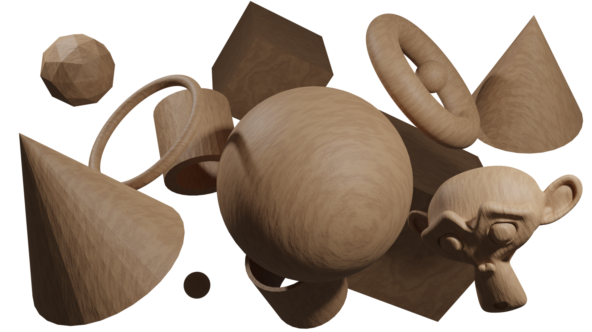

# 3D Library

A collection of Materials, Textures, Shaders, Models and more.

# Collection

## [Materials](materials/)

## Animal
- [ ] [Feather]()
- [x] [Leather](materials/leather.blend)

### Metal

- [ ] [Iron]()
- [ ] [Gold]()
- [ ] [Copper]()

### Wood

- [x] [Oak Bark](materials/oak_bark.blend)
- [ ] [Birch Bark]()
- [ ] [Walnut Bark]()

- [x] [Oak Wood](materials/oak.blend)
- [ ] [Birch Wood]()
- [x] [Walnut Wood](materials/walnut.blend)

- [ ] [Particle Board / Chipboard]()
- [ ] [Planks]()

### Paper, Cardboard, etc.
- [ ] [Paper]()
- [x] [Cardboard](materials/cardboard.blend)

### Stone

- [x] [Cobblestone](materials/cobblestone.blend)
- [ ] [Stone Wall]()
- [ ] [Rock Surface]()

### Natural

- [ ] [Mud]()
- [ ] [Dirt]()
- [ ] [Gravel]()
- [ ] [Sand]()
- [ ] [Snow]()
- [x] [Ice](materials/ice.blend)
- [ ] [Water]()

### Building

- [ ] [Concrete]()
- [ ] [Brick Wall]()
- [ ] [Stone Wall]()
- [ ] [Glass]()

### Fabric

- [x] [Red](materials/fabric_red.blend)
- [x] [Blue](materials/fabric_blue.blend)
- [x] [Green](materials/fabric_green.blend)
- [x] [Purple](materials/fabric_purple.blend)
- [x] [Yellow](materials/fabric_yellow.blend)

- [ ] [Red (Pattern)]()
- [ ] [Blue (Pattern)]()
- [ ] [Green (Pattern)]()
- [ ] [Purple (Pattern)]()
- [ ] [Yellow (Pattern)]()

- [ ] [Leather]()

## [Models](models/)

### Walls

- [ ] [Fence]()
- [ ] [Building Wall]()
- [x] [Rough Plaster](rough_plaster.blend)

### Boardgames

- [ ] [Chessboard]()
- [ ] [Chess Piece (Queen)]()
- [ ] [Chess Piece (King)]()
- [ ] [Chess Piece (Pawn)]()
- [ ] [Chess Piece (Bishop)]()
- [ ] [Chess Piece (Knight)]()
- [ ] [Chess Piece (Rook)]()

- [ ] [Dice]()

### Medieval

- [ ] [Castle]()
- [ ] [Cannon]()

### Deco
- [ ] [Barrel]()
- [ ] [Food Plate]()
- [ ] [Book]()
- [ ] [Book-/Shelf]()

### Food
- [ ] [Cookies]()
- [ ] [Chicken]()
- [ ] [Carrots]()
- [ ] [Pees]()
- [ ] [Burger]()
- [ ] [Pizza]()
- [ ] [Strawberries]()
- [ ] [Berries]()

### Modern Buildings

- [ ] [Hospital]()
- [ ] [Small House]()
- [ ] [Big House]()
- [ ] [Skyscraper]()

### Other

- [x] [Material Preview](models/material_preview.blend)

# [Screenshots](screenshots/)

|   |   |
| - | - |
|[Cobblestone](materials/cobblestone.blend) |[Fabric (Red)](materials/fabric_red.blend) |
|[Oak Bark](materials/oak_bark.blend) |[Oak](materials/oak.blend) |
|[Walnut](materials/walnut.blend) |[Leather](materials/leather.blend) |
|[Ice](materials/ice.blend) |[Water](materials/water.blend) |
|[Rough Plaster](materials/rough_plaster.blend) |[Cardboard](materials/cardboard.blend) |

# How to use

You need to have `Node Wrangler` and `Node Presets` installed and activated in your blender installation.
Some Materials use `Experimental` Mode and `Raytracing / Cycles` Mode.

You can use ANY materials you find here, but be warned: some materials, textures, models come from youtube tutorials, etc.
